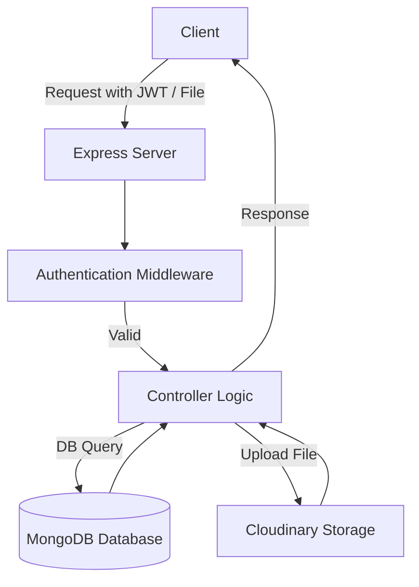

# 📌 Backend-2

A production-ready **Node.js + Express backend** that provides authentication, file uploads, database integration, and scalable architecture.  
This project is designed with best practices in mind so it can be easily extended into a real-world application.

---

## 🚀 Features
- **Authentication & Security**
  - Password hashing with **bcrypt**
  - Secure token-based authentication with **JWT**
  - Cookie management using **cookie-parser**
- **File Uploads**
  - Local and cloud uploads supported with **Multer** and **Cloudinary**
  - Cloud storage for images, videos, and documents
- **Database**
  - **MongoDB** with **Mongoose ODM**
  - Pagination support using **mongoose-aggregate-paginate-v2**
- **Configuration & Utilities**
  - **dotenv** for environment variables
  - **CORS** enabled for cross-origin requests
  - Prettified codebase with **Prettier**
- **Developer Experience**
  - Hot-reloading via **Nodemon**
  - Clean code structure (routes, controllers, models, middlewares)

---

## 🏗️ Tech Stack
- **Backend Framework:** Express.js  
- **Database:** MongoDB + Mongoose  
- **Authentication:** JWT, bcrypt  
- **File Uploads:** Multer + Cloudinary  
- **Middleware:** cookie-parser, cors  
- **Utilities:** dotenv, prettier  
- **Dev Tools:** nodemon  

---

## 📂 Project Structure
```
Backend2/
│── .env                 # Environment variables
│── package.json         # Dependencies & scripts
│── src/ or app/         # Main source code (controllers, routes, models)
│── utils/               # Helper functions (async handler, error handling, etc.)
│── middlewares/         # Custom middlewares
│── models/              # Mongoose schemas
│── controllers/         # Route logic
│── uploads/             # Temporary file storage
```

---

## ⚙️ Installation & Setup
```bash
# Clone repository
git clone <repo-url>
cd Backend2

# Install dependencies
npm install

# Setup environment variables
cp .env.example .env

# Start development server
npm run dev
```

---

## 🔑 Environment Variables
Create a `.env` file in the root directory with the following:

```env
PORT=5000
MONGO_URI=mongodb+srv://<your-db-uri>
JWT_SECRET=your_jwt_secret
CLOUDINARY_CLOUD_NAME=your_cloud_name
CLOUDINARY_API_KEY=your_api_key
CLOUDINARY_API_SECRET=your_api_secret
```

---

## 📤 File Uploads
- Uses **Multer** for handling multipart form-data.  
- Integrates with **Cloudinary** for cloud storage.  
- Supports images, documents, and videos.  

---

## 📦 Available Scripts
```bash
npm run dev    # Run in development mode with nodemon
npm start      # Run in production mode
```

---

## 🔒 Security Practices
- Passwords hashed with **bcrypt** before storage.  
- JWT tokens used for session-less authentication.  
- Environment variables stored securely in `.env`.  
- CORS policy enabled to control API access.  

---

## 🛠️ Future Improvements
- API documentation with Swagger/OpenAPI  
- Unit & Integration tests with Jest  
- Role-based authorization  
- CI/CD pipeline integration  

---

## 🔗 Technologies Workflow


---

## 👨‍💻 Author
Built with ❤️ and clean code practices.  
This backend is structured to scale and can serve as the foundation for **production-grade applications**.
